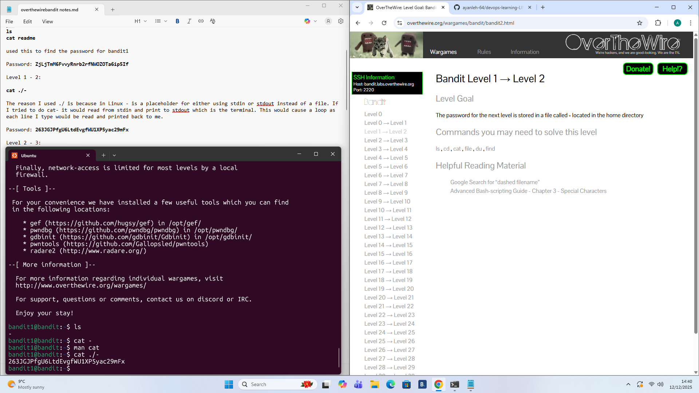

# Level 1 - 2

## Goal:
The password for the next level is stored in a file called ```-``` located in the home directory
## Steps I Took:
- Once I logged on i used ```ls``` to check the contents of the directory
- I then attempted to use the command```cat -``` but this did not work as whatever i typed in the terminal was read and printed back to me.
- Therefore i used the ```man cat``` command to check the man page and realised that in linux ```-``` is a placeholder for either using stdin or stdout instead of a file.
- Finally i used ```cat ./-``` to read the file and acquire the password.
### Password Found: 
```263JGJPfgU6LtdEvgfWU1XP5yac29mFx```

.


