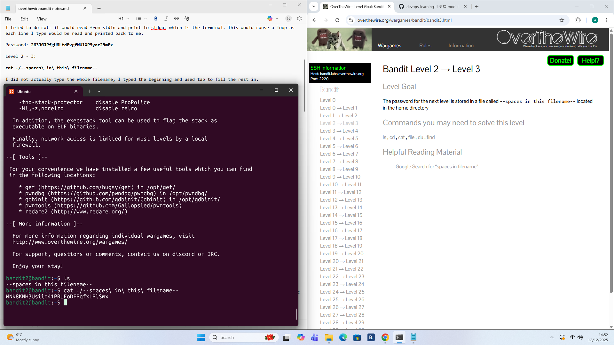

# Level 2 - 3

## Goal:
The password for the next level is stored in a file called ```--spaces in this filename--``` located in the home directory
## Steps I Took:
- Once I logged on i used ```ls``` to check the contents of the directory
- Instead of typing the file name i simply typed the beginning of the filename and used tab to fill the rest while also ensuring to use ```./``` as the filename started with ```-```
- I used ```cat ./--spaces\ in\ this\ filename--``` to read the file and get the password for the next level
### Password Found: 
``` MNk8KNH3Usiio41PRUEoDFPqfxLPlSmx```

.


