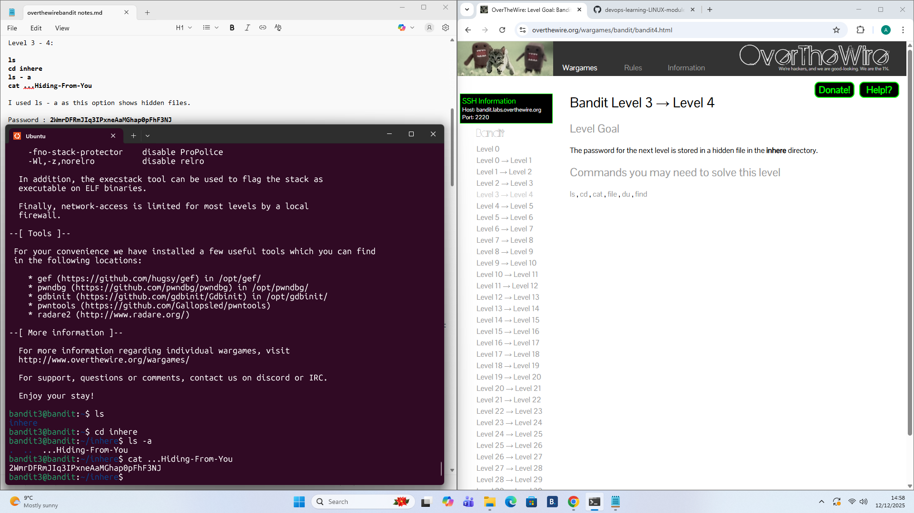

# Level 3 - 4

## Goal:
The password for the next level is stored in a hidden file in the ```inhere``` directory
## Steps I Took:
- Once I logged on i used ```ls``` to check the contents of the directory
- Then i used ```cd inhere``` to go inside the ```inhere``` directory
- I knew i was looking for a hidden file inside the directory, the command that allows this is using the same ```ls``` command but with the ```-a``` option
- Used the command ```ls -a``` to show hidden files
- Finally used ```cat ...Hiding-From-You``` to read the file and acquire the password
### Password Found: 
```2WmrDFRmJIq3IPxneAaMGhap0pFhF3NJ ```

.


