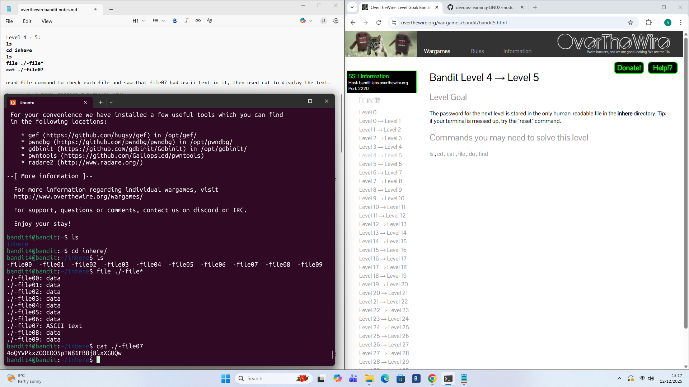

# Level 4 - 5

## Goal:
The password for the next level is stored in the only human-readable file in the ```inhere``` directory.
## Steps I Took:
- Once I logged on i used ```ls``` to check the contents of the directory
- Then i used ```cd inhere``` to go inside the ```inhere``` directory
- I then used the ```file``` command to check each file and found that ```-file07``` was human readable.
- The command I used was ```file ./-file*``` . The reason is because since the files had the similar names just different numbers I could use ```*``` to include all the files that began with ```-file```
- Finally i used ```cat ./-file07``` to read the file and acquire the password.
### Password Found: 
```4oQYVPkxZOOEOO5pTW81FB8j8lxXGUQw ```

.


