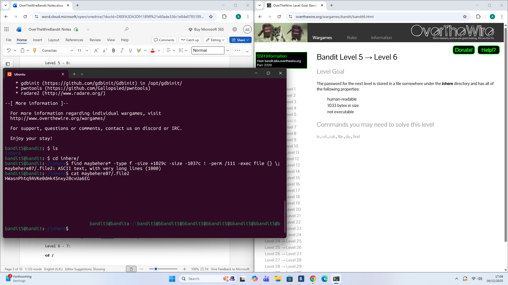

# Level 5 - 6

## Goal:
The password for the next level is stored in a file somewhere under the ```inhere``` directory and has all of the following properties.
- human readable 
- 1033 bytes in size
- not executable
  
## Steps I Took:
- used ```maybehere*``` after ```ls``` to ensure that all directories I want to include in the search are correct. 
- used ```-type f``` to find files in those directories. 
- used ```-size +1029c``` ```-size -1037c``` as previously when I tried using ```-size -1033c``` I kept getting no output. after doing some research I realised that the file might not be exactly 1033 bytes in size therefore I included a range of 1029 bytes to 1037 bytes in size to ensure the file would be included in the search. 
- used ```!-perm /111``` to not include executable files.
- used ```-exec file {} \;``` to execute the file command to confirm that the file was human readable. 
- used ```cat maybehere07/.file2``` to read the file and acquire the password.

On the earlier levels I was not dealing with large amounts of data so it was fine to do it manually. 

However, I realised when dealing with a large amount of files and directories the find command is a really powerful tool as it would be really inefficient to go into each directory and check each file manually.

The most important thing when making long commands is to run the command at each stage to ensure it is working correctly before moving on.

Heres the full command i ran:
```find maybehere* -type f -size +1029c -size -1037c ! -perm /111 -exec file {} \;``` 


```HWasnPhtq9AVKe0dmk45nxy20cvUa6EG```

.

