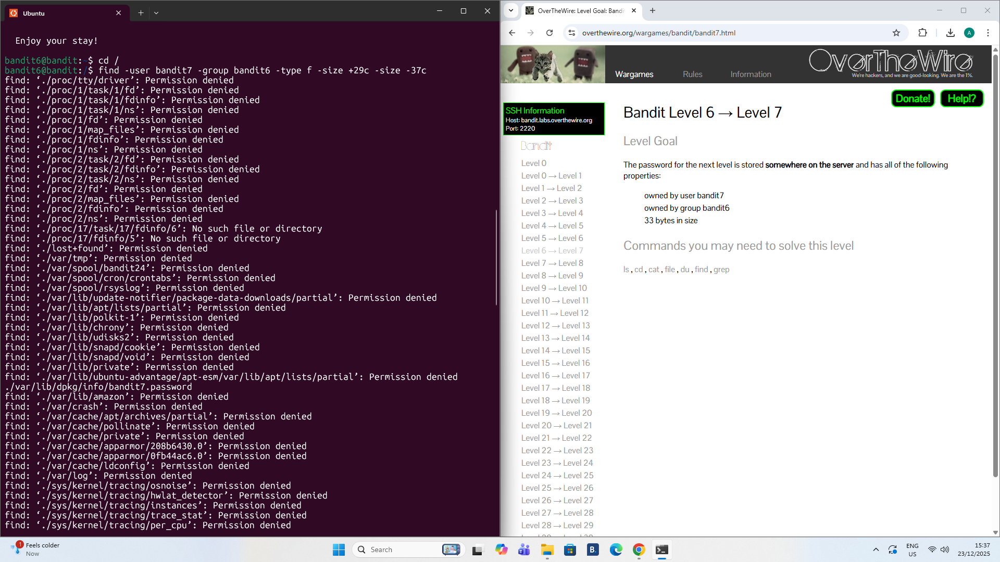
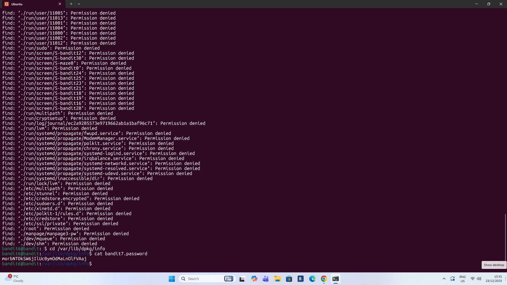

# Level 6 - 7

## Goal:
The password for the next level is stored somewhere on the server and has all the following properties:

- owned by user bandit7
- owned by group bandit6
- 33 bytes in size
## Steps I Took:
- Once I logged on i used ```cd /``` to move to the root directory
- Then i used ```find -user bandit7 -group bandit6 -type f -size +29c -size -37c``` to search the entire filesystem 
- The ```-user``` and ```-group``` options are used to specify specific groups and users.
- used ```cd /var/lib/dpkg/info``` to move directory
- used ```cat bandit7.password``` to read the file and acquire the password.
  
### Password Found: 
```morbNTDkSW6jIlUc0ymOdMaLnOlFVAaj ```


## Lessons Learned:

- After doing some research I realised that because of my lack of Linux knowledge I don't really have the understanding where certain files could be. 

- Realistically I should of limited the ```find``` command to certain directories , omit executable files and redirected the error output to ```2>/dev/null``` to keep results readable

- This is a better approach than searching the entire filesystem from the root as I will get a lot of permission denied. 


.
.


