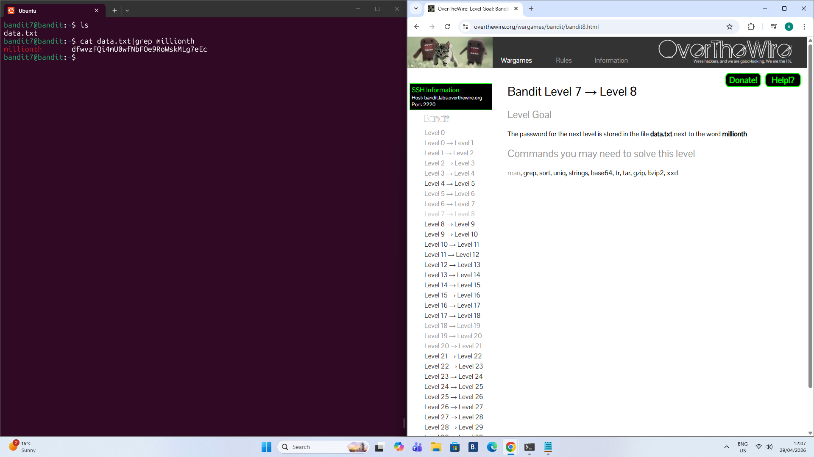

# Level 7 - 8

## Goal:
The password for the next level is stored in the file `data.txt` next to the word `millionth`.

## Steps I Took:
- used `ls` to locate the file `data.txt`.
- used `cat data.txt|grep millionth` to first run `cat.data.txt`, redirect the output into `grep millionth` and print to the terminal.
- used `cat` to read the file `data.txt`
- used `|` to run single line multicommands. 
- used `grep` to find lines with the occurence of `millionth`.

  
### Password Found: 
`dfwvzFQi4mU0wfNbFOe9RoWskMLg7eEc `

## Lessons Learned:
- Firstly when dealing with large text files it is inefficient to scroll through the text to find your objective.
- Secondly running multiple commands on a single line is much quicker.

.
